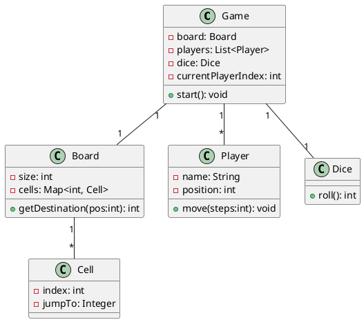

# Snake and Ladder — Beginner-friendly Design

This document explains a simple, beginner-friendly design for the classic board game *Snake and Ladder*.

## 1. Requirements

### Functional requirements
1. Support 2 to N players (N >= 2).
2. Board size is configurable (commonly 10x10 = 100 cells).
3. Players take turns rolling a dice (1–6) and move forward accordingly.
4. If a player lands on the start of a ladder, they move up to the ladder's end.
5. If a player lands on the head of a snake, they move down to the snake's tail.
6. First player to reach the final cell (exactly) wins.
7. The game should print moves and the winner.

### Non-functional requirements
- Simple console-based UI.
- Clean, modular OOP-based code.

## 2. Key Entities

- **Game** — coordinates gameplay.
- **Board** — stores cells, snakes, ladders.
- **Cell** — may contain a jump (snake/ladder).
- **Player** — stores player name & position.
- **Dice** — simulates dice roll.

## 3. UML Diagram (PlantUML)



## 4. Full Java Code (Runnable)

```java
import java.util.*;

public class SnakeAndLadder {

    public static void main(String[] args) {
        Board board = new Board(100);

        // ladders
        board.addJump(2, 38);
        board.addJump(7, 14);
        board.addJump(8, 31);
        board.addJump(15, 26);
        board.addJump(21, 42);
        board.addJump(28, 84);
        board.addJump(36, 44);
        board.addJump(51, 67);
        board.addJump(71, 91);
        board.addJump(78, 98);
        board.addJump(87, 94);

        // snakes
        board.addJump(16, 6);
        board.addJump(46, 25);
        board.addJump(49, 11);
        board.addJump(62, 19);
        board.addJump(64, 60);
        board.addJump(74, 53);
        board.addJump(89, 68);
        board.addJump(92, 88);
        board.addJump(95, 75);
        board.addJump(99, 80);

        List<Player> players = new ArrayList<>();
        players.add(new Player("Alice"));
        players.add(new Player("Bob"));

        Game game = new Game(board, players, new Dice());
        game.start();
    }

    // Game Class
    static class Game {
        private final Board board;
        private final List<Player> players;
        private final Dice dice;
        private int currentPlayerIndex = 0;
        private final int WIN_POS;

        public Game(Board board, List<Player> players, Dice dice) {
            this.board = board;
            this.players = players;
            this.dice = dice;
            this.WIN_POS = board.getSize();
        }

        public void start() {
            System.out.println("Starting Snake and Ladder Game with " + players.size() + " players.");
            boolean won = false;

            while (!won) {
                Player current = players.get(currentPlayerIndex);
                int roll = dice.roll();
                System.out.println(current.getName() + " rolled " + roll);

                int newPos = current.getPosition() + roll;

                if (newPos > WIN_POS) {
                    System.out.println(current.getName() + " needs exact roll to reach " + WIN_POS);
                } else {
                    current.setPosition(newPos);
                    System.out.println(current.getName() + " moved to " + newPos);

                    int dest = board.getDestination(newPos);
                    if (dest != -1 && dest != newPos) {
                        if (dest > newPos) {
                            System.out.println("Ladder! " + current.getName() + " climbs to " + dest);
                        } else {
                            System.out.println("Snake! " + current.getName() + " slides to " + dest);
                        }
                        current.setPosition(dest);
                    }

                    if (current.getPosition() == WIN_POS) {
                        System.out.println("\n" + current.getName() + " wins the game! 🎉");
                        won = true;
                        break;
                    }
                }

                currentPlayerIndex = (currentPlayerIndex + 1) % players.size();
                try { Thread.sleep(300); } catch (Exception e) {}
            }
        }
    }

    // Board Class
    static class Board {
        private final int size;
        private final Map<Integer, Integer> jumps = new HashMap<>();

        public Board(int size) { this.size = size; }

        public int getSize() { return size; }

        public void addJump(int from, int to) {
            jumps.put(from, to);
        }

        public int getDestination(int pos) {
            return jumps.getOrDefault(pos, -1);
        }
    }

    // Player Class
    static class Player {
        private final String name;
        private int position = 0;

        public Player(String name) { this.name = name; }

        public String getName() { return name; }

        public int getPosition() { return position; }

        public void setPosition(int pos) { this.position = pos; }
    }

    // Dice Class
    static class Dice {
        private final Random random = new Random();

        public int roll() {
            return random.nextInt(6) + 1;
        }
    }
}
```

---

## 5. Notes
- You may customize snakes/ladders, board size, or add multiple dice.
- The design follows clean OOP for easy understanding.

