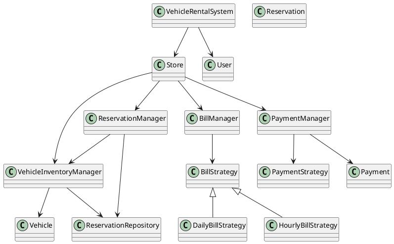

# Car Rental System — Low Level Design (LLD)

---

## 1. Introduction

These notes provide a **very detailed, interview-ready Low Level Design (LLD)** for a **Car Rental System**, created strictly using:
- The complete transcript you provided
- The detailed UML diagrams (Excalidraw screenshots)

The intent of this document is not just to show *what* classes exist, but to clearly explain:
- **Why each class exists**
- **What responsibility it owns**
- **How objects collaborate**
- **How concurrency is safely handled**

This style of documentation is ideal for:
- LLD interview preparation
- Revision notes before interviews
- Explaining design decisions confidently as a senior engineer

---

## 2. Problem Statement

Design a **Car Rental System** where:
- Users can rent vehicles from nearby stores
- Vehicles can be booked for a date range
- Two users must NOT be able to book the same vehicle for overlapping dates
- Billing and payment should be flexible

The system should be extensible to support:
- Two-wheelers, four-wheelers
- Hourly and daily billing
- Multiple payment modes

---

## 3. User Flow (Step-by-Step)

```
User
 → Select Location
   → Select Store
     → Search Vehicles (VehicleType + Date Range)
       → Select Vehicle
         → Create Reservation
           → Start Trip
             → Submit Vehicle
               → Generate Bill
                 → Make Payment
```

This flow is **central** to the entire design and drives entity identification.

---

## 4. How Entities Were Identified

While analyzing the flow, we list down **nouns** and **responsibility holders**:

- User
- Vehicle
- Store
- Reservation
- Bill
- Payment

Next, we identify **behavior-heavy objects** (managers):

- VehicleInventoryManager
- ReservationManager
- BillManager
- PaymentManager

And finally **supporting components**:

- ReservationRepository (storage)
- Strategy interfaces (varying logic)

---

## 5. Core Domain Entities (POJO Classes)

### 5.1 User

```java
class User {
    int userId;
    String userName;
    String drivingLicenseNo;
}
```

User is a **simple data holder**. No business logic is placed here.

---

### 5.2 Vehicle

```java
class Vehicle {
    int vehicleId;
    String vehicleNo;
    VehicleType vehicleType;        // TWO_WHEELER, FOUR_WHEELER
    int dailyRentalCost;
    VehicleStatus status;           // AVAILABLE, BOOKED, MAINTENANCE
}
```

Important Notes:
- Vehicle is **not intelligent**
- It does NOT decide availability
- It does NOT handle booking

All such logic is delegated to the inventory manager.

---

## 6. Store — Central Orchestrator

```java
class Store {
    int storeId;
    Location location;

    VehicleInventoryManager inventoryManager;
    ReservationManager reservationManager;
    BillManager billManager;
    PaymentManager paymentManager;
}
```

Why Store exists:
- Represents a physical rental outlet
- Acts as an **orchestrator**, not a logic-heavy class
- Delegates responsibilities to managers

---

## 7. VehicleInventoryManager (Most Critical Class)

Each store has its **own inventory manager** (NOT a singleton).

```java
class VehicleInventoryManager {

    Map<Integer, Vehicle> vehicles;
    Map<Integer, List<Integer>> vehicleVsReservationIds;
    Map<Integer, Lock> vehicleLocks;

    ReservationRepository reservationRepo;
}
```

### Responsibilities

1. Maintain all vehicles in the store
2. Track reservations per vehicle
3. Check vehicle availability for a date range
4. Enforce **vehicle-level locking**

### Why Vehicle-Level Locking?

Concurrent collections alone do NOT prevent logical conflicts.

Without locking:
- Two threads may see a vehicle as available
- Both create reservations
- Result: **double booking**

With locking:
- Only one thread can reserve a vehicle at a time

---

## 8. Reservation

```java
class Reservation {
    int reservationId;
    int vehicleId;
    int userId;
    Date bookedFrom;
    Date bookedTo;
    ReservationType type;     // DAILY, HOURLY
    ReservationStatus status; // SCHEDULED, IN_USE, COMPLETED, CANCELLED
}
```

Design Decision:
- Store only IDs (vehicleId, userId)
- Avoid heavy object graphs

---

## 9. ReservationRepository (Breaking Circular Dependency)

```java
class ReservationRepository {
    Map<Integer, Reservation> reservations;
}
```

Why this class exists:

- ReservationManager needs reservation data
- VehicleInventoryManager also needs reservation data
- Direct dependency would cause **circular reference**

Solution:
- Move reservation storage into a repository
- Both managers depend on the repository

---

## 10. ReservationManager

```java
class ReservationManager {

    VehicleInventoryManager inventory;
    ReservationRepository repository;
}
```

Responsibilities:
- Create reservation
- Cancel reservation
- Start trip
- Complete trip

Key Rule:
- Reservation is created **only after inventory confirms booking**

---

## 11. Concurrency Handling (Interview Favorite)

### Problem
Two users try to reserve the same vehicle for overlapping dates.

### Solution

**Vehicle-level locking using ReentrantLock**

```java
lock.lock();
try {
    if (isAvailable(vehicleId, from, to)) {
        reserveVehicle();
    }
} finally {
    lock.unlock();
}
```

Important Steps:
1. Check availability (initial filtering)
2. Lock vehicle
3. Re-check availability
4. Reserve or fail
5. Release lock

This ensures **atomicity + consistency**.

---

## 12. Billing Design

### 12.1 Bill

```java
class Bill {
    int billId;
    int reservationId;
    double billAmount;
    boolean isPaid;
}
```

Bill stores **minimal required data**.

---

### 12.2 Billing Strategy (Strategy Pattern)

```java
interface BillStrategy {
    Bill generateBill(Reservation reservation);
}
```

#### Implementations

```java
class DailyBillStrategy implements BillStrategy {}
class HourlyBillStrategy implements BillStrategy {}
```

Why Strategy Pattern:
- Billing logic varies
- Easy to add new billing types

---

## 13. Payment Design

### 13.1 Payment

```java
class Payment {
    int paymentId;
    int billId;
    double amountPaid;
    PaymentMode mode; // CASH, UPI, CREDIT
}
```

---

### 13.2 Payment Strategy

```java
interface PaymentStrategy {
    void makePayment(Bill bill, double amount);
}
```

Implementations:
- UPIPaymentStrategy
- CardPaymentStrategy

---

## 14. Managers for Billing & Payment

```java
class BillManager {
    Map<Integer, Bill> bills;
    BillStrategy strategy;
}

class PaymentManager {
    Map<Integer, Payment> payments;
    PaymentStrategy payStrategy;
}
```

---

## 15. VehicleRentalSystem (Root Object)

```java
class VehicleRentalSystem {
    List<Store> stores;
    List<User> users;
}
```

Responsibilities:
- Maintain list of stores
- Maintain list of users
- Entry point to system

---

## 16. UML Diagram (PlantUML)



---

## 17. Final Summary (How to Explain in Interview)

- Start from user flow
- Identify core entities
- Introduce managers for behavior
- Use repositories to avoid circular dependencies
- Handle concurrency with vehicle-level locks
- Use strategy pattern where logic varies

This design is **clean, extensible, concurrency-safe, and interview-ready**.

---

---

## 18. Complete Java Code (LLD Reference Implementation)

> **Note**: This is an in-memory, interview-focused implementation. Thread-safety and structure match the UML.

---

### 18.1 Enums

```java
enum VehicleType {
    TWO_WHEELER,
    FOUR_WHEELER
}

enum VehicleStatus {
    AVAILABLE,
    BOOKED,
    MAINTENANCE
}

enum ReservationType {
    DAILY,
    HOURLY
}

enum ReservationStatus {
    SCHEDULED,
    IN_USE,
    COMPLETED,
    CANCELLED
}

enum PaymentMode {
    CASH,
    UPI,
    CREDIT
}
```

---

### 18.2 Core POJOs

```java
class User {
    int userId;
    String userName;
    String drivingLicenseNo;
}

class Vehicle {
    int vehicleId;
    String vehicleNo;
    VehicleType vehicleType;
    int dailyRentalCost;
    VehicleStatus status;
}

class Reservation {
    int reservationId;
    int vehicleId;
    int userId;
    Date bookedFrom;
    Date bookedTo;
    ReservationType type;
    ReservationStatus status;
}

class Bill {
    int billId;
    int reservationId;
    double billAmount;
    boolean isPaid;
}

class Payment {
    int paymentId;
    int billId;
    double amountPaid;
    PaymentMode paymentMode;
}
```

---

### 18.3 Reservation Repository

```java
class ReservationRepository {
    private Map<Integer, Reservation> reservations = new ConcurrentHashMap<>();

    void save(Reservation r) {
        reservations.put(r.reservationId, r);
    }

    Reservation findById(int id) {
        return reservations.get(id);
    }

    void remove(int id) {
        reservations.remove(id);
    }
}
```

---

### 18.4 VehicleInventoryManager (Concurrency Core)

```java
class VehicleInventoryManager {

    Map<Integer, Vehicle> vehicles = new ConcurrentHashMap<>();
    Map<Integer, List<Integer>> vehicleVsReservationIds = new ConcurrentHashMap<>();
    Map<Integer, ReentrantLock> vehicleLocks = new ConcurrentHashMap<>();

    ReservationRepository reservationRepo;

    VehicleInventoryManager(ReservationRepository repo) {
        this.reservationRepo = repo;
    }

    void addVehicle(Vehicle v) {
        vehicles.put(v.vehicleId, v);
        vehicleVsReservationIds.put(v.vehicleId, new ArrayList<>());
        vehicleLocks.put(v.vehicleId, new ReentrantLock());
    }

    boolean isAvailable(int vehicleId, Date from, Date to) {
        Vehicle v = vehicles.get(vehicleId);
        if (v.status == VehicleStatus.MAINTENANCE) return false;

        for (Integer resId : vehicleVsReservationIds.get(vehicleId)) {
            Reservation r = reservationRepo.findById(resId);
            if (!(to.before(r.bookedFrom) || from.after(r.bookedTo))) {
                return false;
            }
        }
        return true;
    }

    boolean reserveVehicle(int vehicleId, int reservationId, Date from, Date to) {
        ReentrantLock lock = vehicleLocks.get(vehicleId);
        lock.lock();
        try {
            if (!isAvailable(vehicleId, from, to)) return false;
            vehicleVsReservationIds.get(vehicleId).add(reservationId);
            vehicles.get(vehicleId).status = VehicleStatus.BOOKED;
            return true;
        } finally {
            lock.unlock();
        }
    }

    void releaseVehicle(int vehicleId, int reservationId) {
        ReentrantLock lock = vehicleLocks.get(vehicleId);
        lock.lock();
        try {
            vehicleVsReservationIds.get(vehicleId).remove(Integer.valueOf(reservationId));
            vehicles.get(vehicleId).status = VehicleStatus.AVAILABLE;
        } finally {
            lock.unlock();
        }
    }
}
```

---

### 18.5 ReservationManager

```java
class ReservationManager {

    VehicleInventoryManager inventory;
    ReservationRepository repository;

    AtomicInteger reservationCounter = new AtomicInteger(1);

    ReservationManager(VehicleInventoryManager inventory, ReservationRepository repo) {
        this.inventory = inventory;
        this.repository = repo;
    }

    Reservation createReservation(int vehicleId, int userId, Date from, Date to, ReservationType type) {
        int resId = reservationCounter.getAndIncrement();
        if (!inventory.reserveVehicle(vehicleId, resId, from, to)) {
            throw new RuntimeException("Vehicle not available");
        }
        Reservation r = new Reservation();
        r.reservationId = resId;
        r.vehicleId = vehicleId;
        r.userId = userId;
        r.bookedFrom = from;
        r.bookedTo = to;
        r.type = type;
        r.status = ReservationStatus.SCHEDULED;
        repository.save(r);
        return r;
    }

    void startTrip(int resId) {
        repository.findById(resId).status = ReservationStatus.IN_USE;
    }

    void completeTrip(int resId) {
        Reservation r = repository.findById(resId);
        r.status = ReservationStatus.COMPLETED;
        inventory.releaseVehicle(r.vehicleId, resId);
    }
}
```

---

### 18.6 Billing Strategy & Manager

```java
interface BillStrategy {
    Bill generateBill(Reservation r);
}

class DailyBillStrategy implements BillStrategy {
    VehicleInventoryManager inventory;

    DailyBillStrategy(VehicleInventoryManager inv) {
        this.inventory = inv;
    }

    public Bill generateBill(Reservation r) {
        Vehicle v = inventory.vehicles.get(r.vehicleId);
        long days = (r.bookedTo.getTime() - r.bookedFrom.getTime()) / (1000 * 60 * 60 * 24) + 1;
        Bill b = new Bill();
        b.billAmount = days * v.dailyRentalCost;
        b.reservationId = r.reservationId;
        b.isPaid = false;
        return b;
    }
}

class BillManager {
    Map<Integer, Bill> bills = new ConcurrentHashMap<>();
    AtomicInteger billCounter = new AtomicInteger(1);
    BillStrategy strategy;

    Bill generateBill(Reservation r) {
        Bill b = strategy.generateBill(r);
        b.billId = billCounter.getAndIncrement();
        bills.put(b.billId, b);
        return b;
    }
}
```

---

### 18.7 Payment Strategy & Manager

```java
interface PaymentStrategy {
    void makePayment(Bill bill, double amount);
}

class UPIPaymentStrategy implements PaymentStrategy {
    public void makePayment(Bill bill, double amount) {
        bill.isPaid = true;
    }
}

class PaymentManager {
    Map<Integer, Payment> payments = new ConcurrentHashMap<>();
    AtomicInteger paymentCounter = new AtomicInteger(1);
    PaymentStrategy strategy;

    void makePayment(Bill bill, double amount, PaymentMode mode) {
        strategy.makePayment(bill, amount);
        Payment p = new Payment();
        p.paymentId = paymentCounter.getAndIncrement();
        p.billId = bill.billId;
        p.amountPaid = amount;
        p.paymentMode = mode;
        payments.put(p.paymentId, p);
    }
}
```

---

### 18.8 Store & Driver Class

```java
class Store {
    int storeId;

    VehicleInventoryManager inventory;
    ReservationManager reservationManager;
    BillManager billManager;
    PaymentManager paymentManager;

    Store() {
        ReservationRepository repo = new ReservationRepository();
        inventory = new VehicleInventoryManager(repo);
        reservationManager = new ReservationManager(inventory, repo);
        billManager = new BillManager();
        paymentManager = new PaymentManager();
    }
}

public class Driver {
    public static void main(String[] args) {
        Store store = new Store();

        Vehicle car = new Vehicle();
        car.vehicleId = 1;
        car.vehicleNo = "DL01AB1234";
        car.vehicleType = VehicleType.FOUR_WHEELER;
        car.dailyRentalCost = 1000;
        car.status = VehicleStatus.AVAILABLE;

        store.inventory.addVehicle(car);

        Reservation r = store.reservationManager.createReservation(
                1, 101, new Date(), new Date(), ReservationType.DAILY);

        store.reservationManager.startTrip(r.reservationId);
        store.reservationManager.completeTrip(r.reservationId);

        store.billManager.strategy = new DailyBillStrategy(store.inventory);
        Bill bill = store.billManager.generateBill(r);

        store.paymentManager.strategy = new UPIPaymentStrategy();
        store.paymentManager.makePayment(bill, bill.billAmount, PaymentMode.UPI);

        System.out.println("Booking completed successfully");
    }
}
```

---

**End of Detailed Notes**

