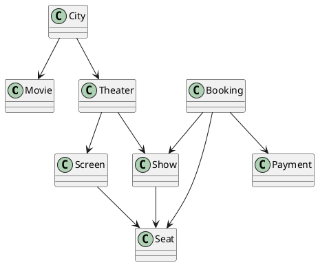

# Movie Ticket Booking System — Low Level Design (LLD)

**File:** `movie-ticket-booking-system.md`

---

## 1. Introduction

This document provides a **production-ready Low Level Design (LLD)** for a **Movie Ticket Booking System** (similar to BookMyShow).  
The design is **city-driven**, **show-centric**, and focuses heavily on **concurrency handling**, which is the most common and critical interview follow-up question.

---

## 2. Functional Requirements

1. User selects a **City**
2. System displays **Movies available in that City**
3. User selects a **Movie**
4. System displays **Theaters and Shows** for that movie
5. User selects a **Show**
6. User selects **Seats**
7. User completes **Payment**
8. System generates **Booking Confirmation**

---

## 3. Non-Functional Requirements

1. No seat should be double-booked
2. High concurrency handling
3. Seat should be temporarily held during payment
4. Automatic seat release on payment failure or timeout
5. Scalable for high traffic
6. Fault-tolerant booking flow

---

## 4. End-to-End User Flow

```
City → Movie → Theater → Show → Seat → Payment → Confirmation
```

---

## 5. Object Identification

| Object | Responsibility |
|------|---------------|
| User | Initiates booking |
| City | Location context |
| Movie | Movie metadata |
| Theater | Physical venue |
| Screen | Movie hall |
| Seat | Individual seat |
| Show | Movie + Screen + Time |
| Booking | Seat reservation |
| Payment | Payment status |

---

## 6. Entity Relationships

- City → Movies (Many-to-Many)
- City → Theaters (One-to-Many)
- Theater → Screens (One-to-Many)
- Screen → Seats (One-to-Many)
- Theater → Shows (One-to-Many)
- Show → Booked Seats (One-to-Many)
- Booking → Payment (One-to-One)

---

## 7. Class Design (Java Style)

### 7.1 Movie

```java
class Movie {
    private String movieId;
    private String movieName;
    private int durationInMinutes;
}
```

---

### 7.2 MovieController

```java
class MovieController {
    private Map<String, List<Movie>> cityVsMovies;
    private List<Movie> allMovies;

    public List<Movie> getMoviesByCity(String city) {
        return cityVsMovies.get(city);
    }
}
```

---

### 7.3 Theater

```java
class Theater {
    private String theaterId;
    private String address;
    private List<Screen> screens;
    private List<Show> shows;
}
```

---

### 7.4 TheaterController

```java
class TheaterController {
    private Map<String, List<Theater>> cityVsTheaters;
    private List<Theater> allTheaters;
}
```

---

### 7.5 Screen

```java
class Screen {
    private String screenId;
    private List<Seat> seats;
}
```

---

### 7.6 Seat & SeatCategory

```java
enum SeatCategory {
    SILVER,
    GOLD,
    PLATINUM
}

class Seat {
    private int seatId;
    private int row;
    private SeatCategory category;
    private double price;
}
```

---

### 7.7 Show

```java
class Show {
    private String showId;
    private Movie movie;
    private Screen screen;
    private LocalDateTime startTime;
    private Set<Integer> bookedSeatIds;
}
```

---

### 7.8 Booking

```java
class Booking {
    private Show show;
    private List<Seat> seats;
    private Payment payment;
}
```

---

### 7.9 Payment

```java
class Payment {
    private String paymentId;
    private boolean paymentSuccessful;
}
```

---

### 7.10 Driver Class — BookMyShow

```java
class BookMyShow {

    private MovieController movieController;
    private TheaterController theaterController;

    public static void main(String[] args) {
        BookMyShow app = new BookMyShow();
        app.initialize();
        app.runBookingFlow();
    }
}
```

---

## 8. Booking Walkthrough Example

1. User selects **Bangalore**
2. Movies displayed: Avengers, Baahubali
3. User selects **Baahubali**
4. Available shows retrieved
5. User selects **4:00 PM Show**
6. User selects **Seat #30**
7. Seat availability verified
8. Booking created
9. Payment successful
10. Booking confirmed

If another user tries **Seat #30**, system responds:

```
Seat already booked. Please select another seat.
```

---

## 9. Concurrency Management (Most Important)

### 9.1 Problem Statement

- Two users attempt to book the same seat
- Seat must not be sold twice
- Seat should be locked temporarily during payment

---

### 9.2 Locking Strategies

#### Pessimistic Locking
- Locks row on read
- Blocks other users
- Poor scalability

#### Optimistic Locking (Chosen)
- Allows parallel reads
- Locks only at update time
- Uses versioning

---

### 9.3 Why Optimistic Locking?

- High read, low write system
- Millions of users viewing seats
- Locking all seats kills throughput
- Best suited for ticket booking

---

### 9.4 Seat-Level Versioning

```java
class SeatAvailability {
    private int seatId;
    private int version;
}
```

---

### 9.5 Optimistic Locking Flow

1. User A reads seat (version = 1)
2. User B reads seat (version = 1)
3. User A updates → version becomes 2
4. User B update fails due to version mismatch

---

### 9.6 Synchronized Update Logic

```java
synchronized (seatLock) {
    if (currentVersion == dbVersion) {
        bookSeat();
        incrementVersion();
    } else {
        throw new SeatAlreadyBookedException();
    }
}
```

---

### 9.7 Temporary Seat Hold using Redis TTL

- Seat locked for **10–15 minutes**
- Redis key with expiry

```text
SET seat:showId:seatId userId NX EX 900
```

---

### 9.8 Failure Scenarios

| Scenario | Handling |
|--------|---------|
| Payment fails | Redis TTL releases seat |
| App crash | TTL auto-expires |
| Concurrent booking | Version mismatch |
| User abandons | Seat unlocked automatically |

---

## 10. UML Diagram (PlantUML)



---

## 11. Common Interview Follow-Up Questions

1. Why not pessimistic locking?
2. How will you scale this for high traffic?
3. What if Redis goes down?
4. How do you handle payment failures?
5. How would you support dynamic pricing?

---

## 12. Improvements & Extensions

1. Microservices architecture
2. Distributed locking (Redis Redlock / Zookeeper)
3. Read replicas and caching
4. Retry and circuit breaker mechanisms

---

## 13. Summary

- City-based discovery
- Clear object modeling
- Optimistic locking for concurrency
- Redis TTL for seat holding
- Interview-ready, production-aligned design

---

**End of Document**

